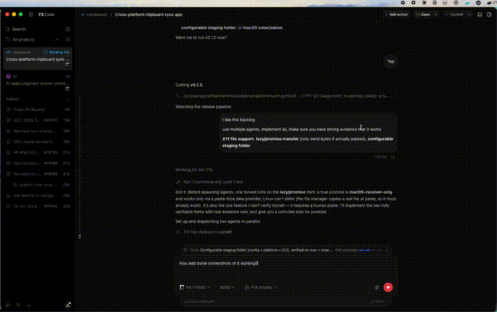
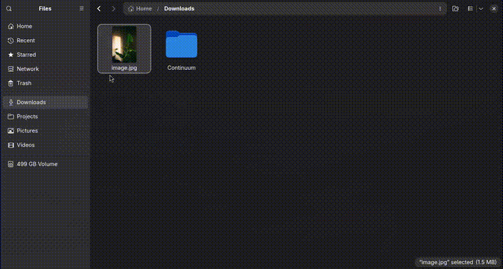

# Continuum

Clipboard sync between macOS and Linux on your local network. Copy on one machine,
paste on another — text, images, and files. No cloud, no account, no telemetry.

## What you get

- **Text, images, and files** sync both ways between macOS and Linux.
- **Lives in the tray / menu bar** — no main window, nothing to babysit.
- **End-to-end encrypted** with Noise IK; peers are pinned by public key.
- **Finds peers by itself** on the LAN (mDNS) — no IPs to configure.
- **LAN-only.** Nothing leaves your network.

Received files are saved to `~/Downloads/Continuum` (never overwritten, ≤100 MB each).
HTML/RTF are intentionally **not** synced: web apps put styled HTML on the clipboard,
and re-offering it corrupts pasted text on Linux. Plain text and PNG images are what
travel.

## Examples

Copy on one machine, paste on the other.

**Text**



**Image**



Full-quality clips: [text](docs/media/copy-text-then-paste-text.mp4) ·
[image](docs/media/copy-image-then-paste-image.mp4).

## Install

### macOS

Download `Continuum-X.Y.Z.zip` from [Releases](../../releases), unzip, and move
`Continuum.app` to `/Applications`. The build is ad-hoc signed, so clear the quarantine
flag the first time:

```sh
xattr -dr com.apple.quarantine /Applications/Continuum.app
```

Then launch it from Applications. A source build can also register it to start at login
with `continuum install-service`.

macOS 15.4+ may ask for pasteboard access — allow Continuum if sync stalls.

### Linux

The quickest path is a source build, which includes the GTK tray:

```sh
git clone https://github.com/JonRoosevelt/continuum
cd continuum
scripts/install.sh
```

An Arch `PKGBUILD` is in [`packaging/`](packaging). The prebuilt
`continuum-X.Y.Z-x86_64-linux.tar.gz` is the **headless** daemon (no tray) — drop it in
`~/.local/bin` and run it as a service if you don't need a tray.

On Wayland you also need `wl-clipboard`, and the tray needs an AppIndicator /
StatusNotifier host.

## Pair two devices

Pairing pins each device's public key, so it only has to be done once.

1. Open the tray menu → **Pair device…** on **both** machines. Each starts listening
   automatically.
2. In one window, click the other device under **Nearby devices**.
3. Both windows show the same 6-digit code. Click **Confirm** on one, then on the other.

The devices connect immediately — no restart — and reconnect on their own from then on.
The code is a short-authentication string: if the two screens don't match, don't confirm.

Prefer the terminal?

```sh
continuum pair-listen     # on device A
continuum pair <A-host>   # on device B
```

If **Nearby devices** stays empty (mDNS blocked on your network), pairing still works:
type the other device's IP into the box and click **Pair** on one side while the other is
listening.

## Everyday use

The tray menu:

- **Continuum — connected** — status line
- **Pause sync** — stop sending and receiving without quitting
- **Send clipboard now** — re-send the current clipboard
- **Pair device…** — pair, see connection state, or unpair
- **Quit Continuum**

Then just copy as usual; the other machine has it within a moment.

## Troubleshooting

**Devices don't find each other.** Usually a firewall. Allow inbound TCP **8770** (sync)
and **8771** (pairing):

```sh
sudo ufw allow 8770/tcp && sudo ufw allow 8771/tcp
```

**Pairing says "Connection refused".** The other device wasn't listening yet — open
**Pair device…** on both before clicking a nearby device.

**The pairing window says "Connecting…" and never "Connected".** It updates within a
second or two once the link comes up. If it stays stuck, check that the other machine is
running and the firewall above is open.

**Pasted text/images look wrong on Linux.** Only plain text and PNG images are synced;
rich HTML/RTF is deliberately dropped.

**Over a VPN (Tailscale, WireGuard).** mDNS doesn't cross the tunnel, so give the peer a
fixed address (see [Configuration](#configuration)) or pair by IP.

**Linux: no tray icon.** You need an AppIndicator / StatusNotifier host (on GNOME, the
AppIndicator extension). Otherwise run `continuum --headless` and use the CLI.

## Configuration

- macOS: `~/Library/Application Support/continuum/config.json`
- Linux: `~/.config/continuum/config.json`

```json
{
  "name": "my-laptop",
  "listen": "0.0.0.0:8770",
  "download_dir": null,
  "peers": [
    { "name": "desktop", "address": null, "public_key": "<64 hex chars>" }
  ]
}
```

- **`address`** — optional. Leave `null` on a LAN: mDNS finds the peer and the connection
  survives IP changes. Set `host:port` only when multicast is blocked or over a VPN.
- **`download_dir`** — where received files go; `null` → `~/Downloads/Continuum`. A leading
  `~` and relative paths resolve against your home directory. `continuum status` prints the
  effective path.

## CLI

| command | purpose |
| --- | --- |
| `continuum` | run the tray app |
| `continuum --headless` | run without a GUI |
| `continuum status` | config path, listen address, peers, download dir |
| `continuum show-id` | print this device's id and public key |
| `continuum pair <host>` / `pair-listen` | interactive pairing |
| `continuum peer list` | list paired peers |
| `continuum peer remove <name\|short-id>` | unpair |
| `continuum peer add <name> <host:port> <public_key_hex>` | manual pairing |
| `continuum dump` | print the current clipboard representations (debug) |
| `continuum put` | copy stdin to the clipboard and hold it |
| `continuum install-service` / `uninstall-service` | start at login (launchd / systemd) |

## How it works

- Each OS watches clipboard changes (macOS `NSPasteboard`; Linux Wayland data-control /
  X11 selections) and writes remote content back.
- Peers talk over an encrypted **Noise IK** TCP connection (`X25519`, `ChaCha20-Poly1305`,
  `BLAKE2s`), with static keys pinned in config.
- Changes are broadcast to every connected peer; `BLAKE3` hashes deduplicate and a Lamport
  clock resolves conflicts (last writer wins).
- Identity is an `X25519` keypair; `DeviceId = BLAKE3(public key)`.
- Devices advertise and discover over mDNS `_continuum._tcp.local.`.

## Security & privacy

- LAN-only; no cloud, account, or telemetry.
- Every payload is end-to-end encrypted; a peer is trusted only if its static key is
  pinned in config.
- Pairing adds a 6-digit short-authentication string that both devices must match,
  defeating a man-in-the-middle.
- Sensitive clipboard content is skipped: `org.nspasteboard` transient/concealed/
  auto-generated, `com.apple.is-remote-clipboard`, `x-kde-passwordManagerHint`.
- Clipboard content is never written to disk. Copied **files** are the exception — they
  land in `~/Downloads/Continuum` and are never overwritten (a numeric suffix is added on
  collision).

Known gaps: the identity key is stored as a `0600` file, not yet in the OS keychain /
libsecret; on Wayland, clipboard writes above 48 KiB go through `wl-copy` (wl-clipboard-rs
truncates large writes) and X11 large-payload / INCR is not implemented.

## Platform notes

- **macOS.** Menu-bar-only (`LSUIElement`). A downloaded, ad-hoc-signed build is blocked by
  Gatekeeper — clear the quarantine flag (above) or right-click → Open.
- **Linux Wayland.** Works on compositors that expose data-control (KDE, Sway, Hyprland,
  niri, COSMIC, labwc, …). **GNOME/Mutter does not expose it** — use an X11 session or
  XWayland.
- **Linux X11.** Supported, including files. Set `CONTINUUM_FORCE_X11=1` to force the X11
  backend.

## Build from source

```sh
cargo build --release                                          # tray app (macOS + Linux w/ GTK)
cargo build --release -p continuum-app --no-default-features   # headless, no GTK
scripts/bundle-macos.sh                                        # dist/Continuum.app (LSUIElement)
```

## Releases

Push a `vX.Y.Z` tag and CI publishes a GitHub Release with:

- `Continuum-X.Y.Z.zip` — macOS `.app` (unsigned, ad-hoc signed for local use)
- `continuum-X.Y.Z-x86_64-linux.tar.gz` — headless Linux binary
- `SHA256SUMS`

Released under the MIT license.
